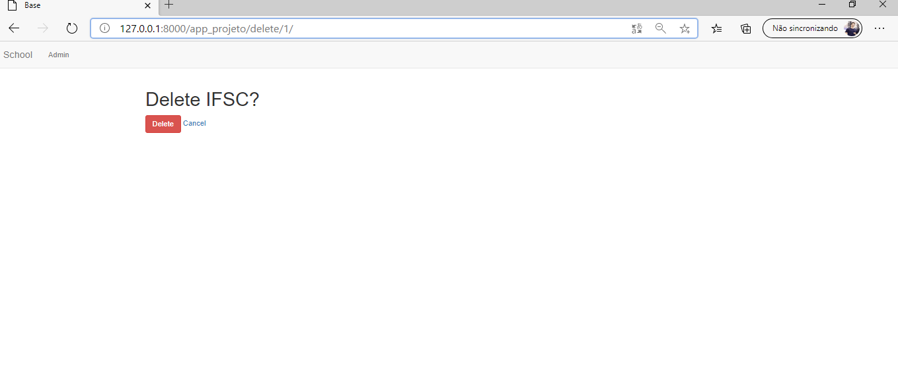

# Web-CRUD

### In this small and simple project, the crud system is shown to manipulate a list of schools and their students. I didn´t create a CRUD system for the students, so just the admin can do that.

***The meaning of CRUD***
> C- create a new school \
> R- read the schools from a database, in a list. \
> U- upgrate an existing school \
> D- delete an existing school

***Functionalities***
1. Base Page

   
   
2. Create view

By adding to the url: app_projeto\create, a new page will open to create a new school, with a form to fill

   
   
3. Detail view
 
When you submit your completed form, automatically you will go to the detail view page

   

4. Update view

By clicking in [update](#) buttom, a new page will open to update this new school, with a form to fill and modify those infomations

   
   
5. List view

By clicking in [School](#) you can see all the created Schools \
:heavy_exclamation_mark: clicking in one school, you can see the details

   
   
6. Delete view

By writing 127.0.0.1.8000/app_projeto/delete/{pk} you can delete the school corresponding to that primary key 

   

:triangular_flag_on_post: This project, despite being simple, i hope it helps you to better understand the generic views :triangular_flag_on_post:
